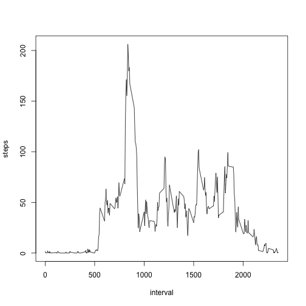

#Patterns of Personal Movement  
##Week 2 Assignment
##Course: Reproducible Research
###By: Mindaugas Mozuraitis


###General activity patterns

```r
temp <- tempfile()
download.file("https://d396qusza40orc.cloudfront.net/repdata%2Fdata%2Factivity.zip",temp)
week2data <- read.csv(unz(temp, "activity.csv"))
unlink(temp)
```

Histogram of the number of the number of steps taken per day:

```r
total_steps_per_day = aggregate(steps~date, data=week2data, sum)
hist(total_steps_per_day$steps)
```


The mean number of steps:

```r
round(mean(total_steps_per_day$steps))
```

```
## [1] 10766
```
The median number of steps:

```r
round(median(total_steps_per_day$steps))
```

```
## [1] 10765
```

The average daily activity pattern:

```r
mean_steps_per_int = aggregate(steps~interval, data=week2data, mean)
plot(steps~interval, data=mean_steps_per_int, type = "l")
```



The interval with the most steps on average:

```r
subset(mean_steps_per_int, steps==max(mean_steps_per_int$steps), select="interval")
```

```
##     interval
## 104      835
```

The number of missing values in the dataset:

```r
sum(is.na(week2data$steps))
```

```
## [1] 2304
```

Missing values are susbtituted with the mean for that interval based on the days where that interval data is not missing:

```r
imputed = merge(week2data, mean_steps_per_int, by="interval") 
imputed$steps = ifelse(is.na(imputed$steps.x), imputed$steps.y, imputed$steps.x)  
```

The histogram of the total number of steps per day after the imputation:

```r
total_steps_per_day2 = aggregate(steps~date, data=imputed, sum)
hist(total_steps_per_day2$steps)
```


The mean number of steps after imputation: 

```r
round(mean(total_steps_per_day2$steps))
```

```
## [1] 10766
```
The median number of steps after imputation:

```r
round(median(total_steps_per_day2$steps))
```

```
## [1] 10766
```

###Activity patterns between weekdays and weekends

```r
imputed$dates = as.Date(imputed$date, format = "%Y-%m-%d")
imputed$weekdays = weekdays(imputed$dates)
imputed$weekpart = as.factor(ifelse(imputed$weekdays %in% c("Sunday", "Saturday"), "weekends", "weekdays"))
```

Activity during weekdays compared to the activity during weekends:

```r
mean_steps_per_wpint = aggregate(steps~interval+weekpart, data=imputed, mean)
library(ggplot2)
qplot(data=mean_steps_per_wpint, interval, steps, geom="line", facets=weekpart~.)
```


library(knitr)
getwd()
knit2html("week2Rcode.html") 
?knit2html
